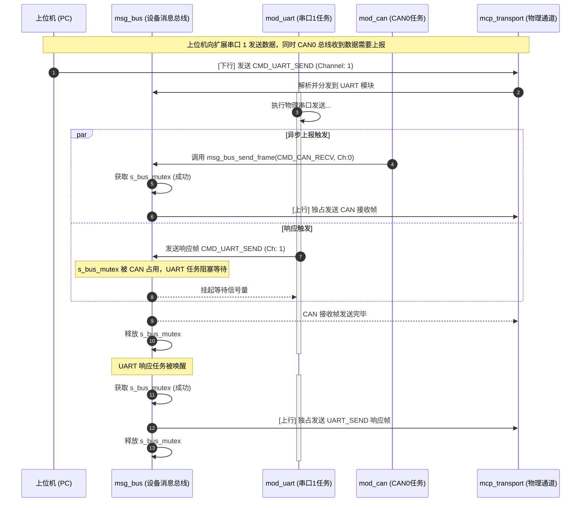

# 05. 固件端网桥数据多路复用与同步设计

## 1. 背景与设计目标

HEX-Bridge 作为基于 ESP32 的多功能硬件接口扩展设备，需要通过单一的物理 MCP 通信链路（如 UART1 串口，或未来的 TCP Socket）为上位机（PC / VS Code 插件）提供多个虚拟外设通道（UART2、CAN0、CAN1、SPI、I2C）的并发复用能力。

本设计文档旨在规避多任务并发读写物理通道时的**数据帧交错（Frame Interleaving）**、**高水位溢出丢包（Buffer Overflow）**和**死锁**风险，为固件开发提供关于**多路复用**、**任务互斥同步**和**流控管理**的技术规范。

---

## 2. 固件整体层次架构

固件采用 **硬件驱动 -> 传输适配 -> 协议解析 -> 消息总线 -> 外设模块** 的分层设计。

```
+-----------------------------------------------------------------------+
|                            外设功能模块层                             |
|  [mod_system]        [mod_uart] (CH0/CH1)       [mod_can] (CAN0/CAN1) |
+-------+--------------------+----------------------+-------------------+
        |                    |                      |
        | 发送响应/事件帧     | 发送响应/事件帧       | 发送响应/事件帧
        v                    v                      v
+-----------------------------------------------------------------------+
|                         msg_bus (核心消息总线)                        |
|   - 维护全局发送互斥锁 s_bus_mutex                                    |
|   - 维护逻辑帧构建与转义静态缓冲区 s_wire_buf                          |
+------------------------------------+----------------------------------+
                                     |
                                     v 调用 ubcp_frame_build() & 物理发送
+-----------------------------------------------------------------------+
|                        mcp_transport (传输适配层)                     |
|            [UART1 传输适配]          [TCP Socket 传输适配 (待扩展)]     |
+------------------------------------+----------------------------------+
                                     |
                                     v 物理 IO
╔═══════════════════════════════════════════════════════════════════════╗
║                      物理 MCP 通信链路 (PC / 上位机)                   ║
╚═══════════════════════════════════════════════════════════════════════╝
```

---

## 3. 双向数据流与互斥设计

物理通道只被物理初始化一次。所有的逻辑通道共享此链路。

### 3.1 下行数据流（PC -> 硬件）
1. **接收任务 (`mcp_recv_task`)**：
   - 独占式地从 MCP 物理接口读取字节流。
   - 逐字节送入流式帧解析器 `ubcp_parser_feed` 进行反转义。
   - 解析器内部实时更新 CRC16。当收到未转义的 `0x7E` (EOF) 且校验通过时，派发完整逻辑帧 `ubcp_frame_t`。
2. **消息总线分发 (`msg_bus_dispatch`)**：
   - 在接收任务的上下文（Thread Context）中，根据 `CmdCode` 范围同步调用对应的模块处理器（如 `mod_uart->handle_cmd` 或 `mod_can->handle_cmd`）。
   - **注意**：为防止阻塞 `mcp_recv_task` 导致物理接收溢出，`handle_cmd` 内部如果执行耗时操作，应通过 FreeRTOS 队列将任务分发到外设模块的专属工作任务中异步执行，禁止在分发上下文中进行大延迟的阻塞等待。

### 3.2 上行数据流（硬件 -> PC）
当多个外设模块（如串口接收任务 `uart_rx_task`、CAN 接收中断服务等）同时向 PC 上报事件数据时，若不进行同步控制，输出到物理通道上的字节流会发生交错，导致 CRC 校验失败。

**互斥发送机制**：
* 消息总线维护全局发送互斥信号量 `s_bus_mutex` 和静态构建缓冲区 `s_wire_buf`（大小 4200 字节，防止大帧转义时栈溢出）。
* 发送流程伪代码：

```c
esp_err_t msg_bus_send_frame(const ubcp_frame_t *frame)
{
    // 1. 获取发送互斥锁，等待超时时间 1000ms
    if (xSemaphoreTake(s_bus_mutex, pdMS_TO_TICKS(1000)) != pdTRUE) {
        HEX_LOGW(TAG, "获取发送锁超时，丢弃帧 CMD=0x%02X", frame->cmd_code);
        return ESP_ERR_TIMEOUT;
    }

    size_t wire_len = 0;
    // 2. 逻辑帧打包与转义，存入 s_wire_buf
    esp_err_t err = ubcp_frame_build(frame, s_wire_buf, sizeof(s_wire_buf), &wire_len);
    if (err == ESP_OK) {
        // 3. 调用物理适配层发送原子帧
        err = mcp_transport_send(s_wire_buf, wire_len);
    }

    // 4. 释放发送锁
    xSemaphoreGive(s_bus_mutex);
    return err;
}
```

---

## 4. 共享链路下的流量控制（Flow Control）

当串口和 CAN 接口同时在高负荷下接收数据并向 PC 疯狂发送事件帧（`CMD_UART_RECV` 和 `CMD_CAN_RECV`）时，物理链路带宽（尤其是 921600 bps 串口）将面临极限。

### 4.1 水位监控与 XON/XOFF 机制
固件必须建立逻辑流控管理，配合消息总线定期向 PC 报告水位：

1. **缓存区水位报告**：
   - 固件周期性或在接收环形缓冲区（Ring Buffer）达到临界值时，通过 `NET_STATUS` 或专门的流控事件帧（`FLOW_CTRL_EVENT`）上报当前各外设接收队列的水位。
2. **主动暂停（XOFF）与恢复（XON）**：
   - **XOFF 触发**：当某个外设通道的软件接收缓冲区水位超过 **80%** (由 `HEX_FLOW_XOFF_PCT` 定义) 时，外设任务向 PC 发送 XOFF 事件帧，请求 PC 暂停下发该通道的数据发送包。
   - **XON 恢复**：当缓冲区水位回落到 **50%** (由 `HEX_FLOW_XON_PCT` 定义) 以下时，外设任务向 PC 发送 XON 事件帧，恢复数据下发。
   - **下位机硬丢弃**：若水位达到 100%，固件应直接丢弃外设新进数据，并在下一个上报帧中标记丢包标志（如 `rxFlags` 中的 `FrameLost` 标志位），同时累加错误计数器，向 PC 报警。

---

## 5. 面向 CAN FD 和网口扩展的适配设计

### 5.1 CAN FD 模块适配设计（`mod_can.c`）
* **通道号映射**：设备最多支持 2 路 CAN 接口，由固件编译期分配静态 Channel ID
  （如 `UBCP_CH_CAN_EXT1 = 3`、`UBCP_CH_CAN_EXT2 = 4`）。
  Host 通过 `GET_TOPOLOGY (0x07)` 获取实际映射关系，不得自行假设通道号。
* **接收中断优化**：CAN 控制器（如 MCP2518FD）收到总线帧后触发 GPIO 中断。固件中的 CAN 接收服务应当从硬件 FIFO 批量读取多帧，合并打包后通过 `msg_bus_send_frame` 批量上报，以降低互斥锁 `s_bus_mutex` 的竞争频率。
* **经典 CAN / CAN FD 报文结构定义**：
  上报 `CMD_CAN_RECV` (0x14) 时，Payload 前 4 字节为统一 `CanID`（含扩展帧、RTR、FD 等 Flags 位），第 5 字节为 `DLC`，之后为最大 64 字节的经典/FD 数据。

### 5.2 网口与 TCP 模块适配设计（`mod_tcp.c`）
* **动态句柄路由**：因为网络连接非常多，无法用静态的 `ChannelID` 来映射。
* **Handle 映射表**：
  - `mod_tcp` 模块内部维护一个动态映射数组：
    ```c
    typedef struct {
        uint16_t conn_handle;      // 0x8001 - 0xFFFE 范围的逻辑句柄
        int      socket_fd;        // lwIP 套接字文件描述符
        bool     is_active;
    } hex_tcp_conn_t;
    ```
  - 当收到 `TCP_SEND (0x54)` 请求时，`mod_tcp` 解析 Payload 中的 `ConnHandle`，查表找到对应的 `socket_fd` 调用 `send()` 发送。
  - 当底层的 `select/poll` 任务检测到某个 `socket_fd` 收到网络数据时，`mod_tcp` 自动为数据打包上 `ConnHandle` 报头，作为 `TCP_RECV (0x55)` 事件帧通过消息总线上报给 PC。

### 5.3 SPI 与 I2C 模块适配设计（`mod_spi.c` / `mod_i2c.c`）
* **同步阻塞与片选管理**：
  - SPI（`0x20-0x2F`）和 I2C（`0x30-0x3F`）物理协议在硬件层是同步、主从结构的应答协议（Master-Slave）。因此，PC 端的读写请求（如 `SPI_TRANSFER`、`I2C_WRITE`）在固件端均采取**同步阻塞响应**模式。
   - **SPI 片选控制**：通过 `ChannelID` 区分不同的 SPI 从设备，每个 CS 片选对应一个
     独立的静态 Channel ID（如 `UBCP_CH_SPI_EXT1 = 5` 对应板载 MCP2518FD，
     `UBCP_CH_SPI_EXT2 = 6` 对应外部扩展引脚 CS）。
* **硬件总线互斥**：
  - 固件端在调用 ESP32 物理 SPI 驱动或 I2C 驱动前，必须通过 ESP-IDF 驱动层自身的互斥锁（如 `i2c_master_write_read_device` 的底层锁）来防止多线程冲突。这与 `msg_bus` 物理发送锁解耦。

### 5.4 GPIO 模块适配设计（`mod_gpio.c`）
* **中断异步事件上报**：
  - 当 GPIO 引脚被配置为输入中断模式（如双边沿触发）时，固件端的 GPIO 中断服务程序（ISR）将中断事件推入专门的 GPIO 工作队列，由后台任务向 PC 发送 `GPIO_INTR_EVENT (0x84)` 异步事件帧，上报触发的引脚号和电平状态。

---

## 6. 多通道并发事务时序图

下图展示了上位机同时进行“扩展串口 1 发送”与“CAN 0 接收数据上报”时的时序冲突与互斥解决流程：


